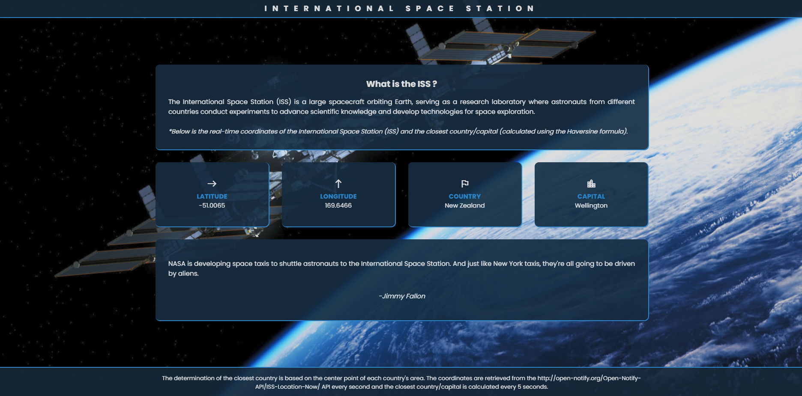

# International Space Station - Live Location

This website shows the live location of the ISS retrieved from the API "http://open-notify.org/Open-Notify-API/ISS-Location-Now/".

## Tech Stack

HTML / CSS / JavaScript & axios for API requests.

## Live Application

[ISS -  Live Location]()

## Features

- Display Live ISS Latitude/Longitude.
- Calculates & displays closest Capital City & Country (using Haversine formula).
- Carousel of famous ISS quotes.

## Usage

1. Clone project locally.
2. Use VSCode or similar to open the project.
3. Run using a live server.

## Screenshots

*Screenshot 1: ISS*